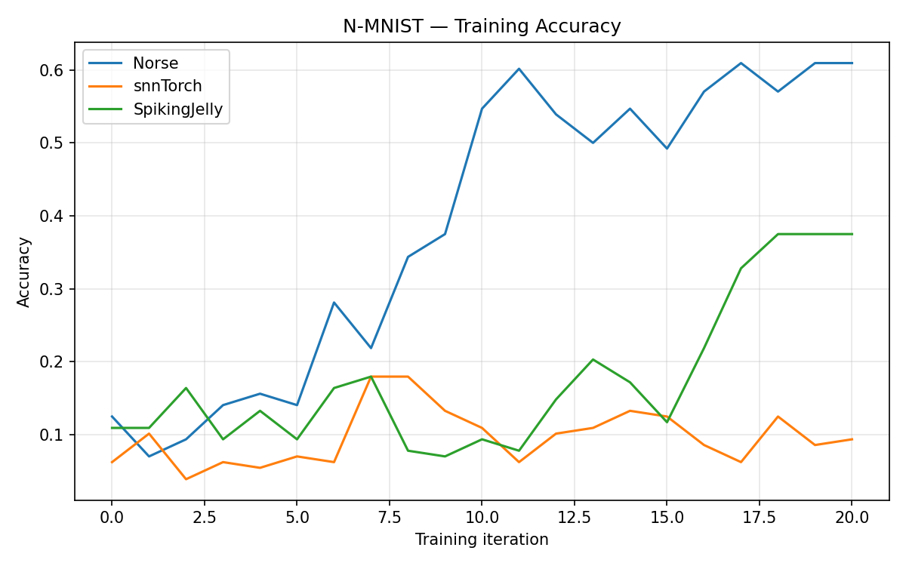
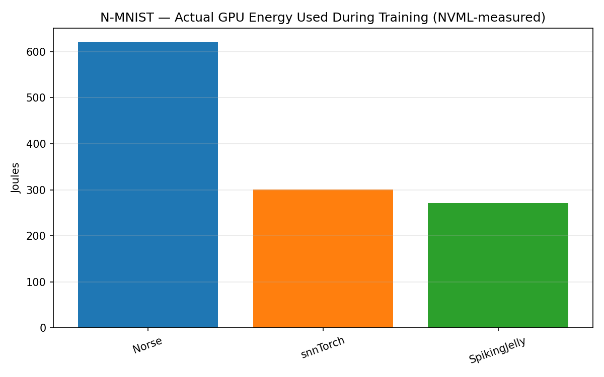
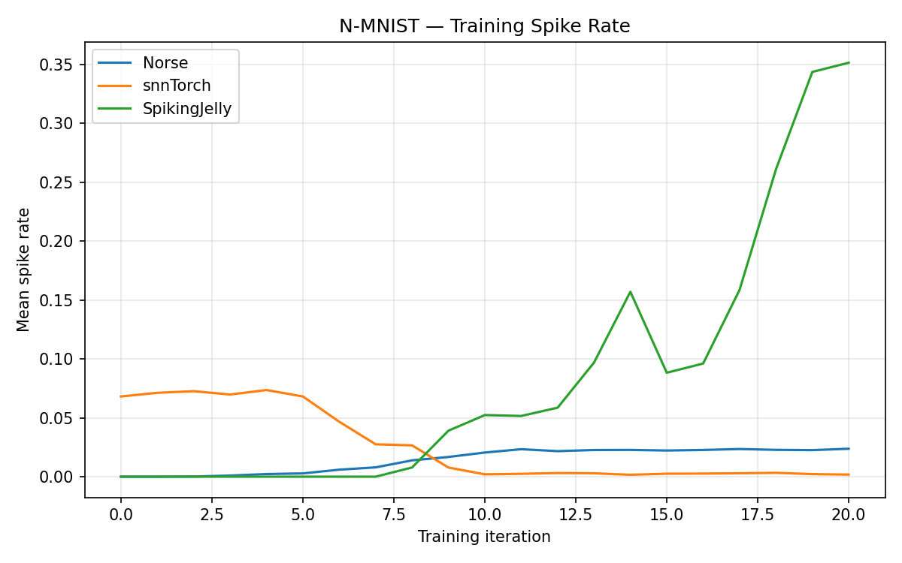
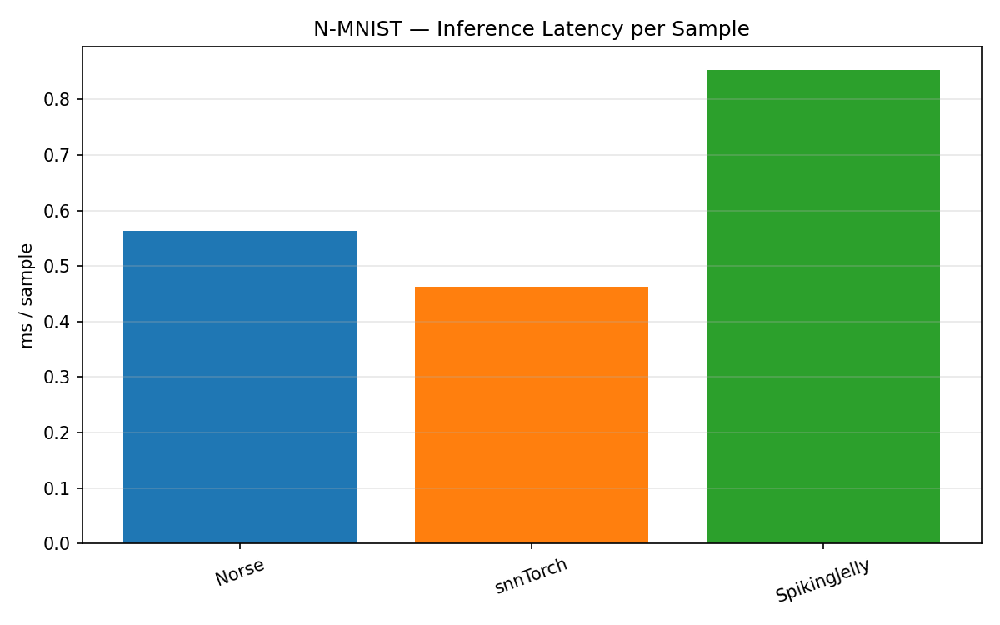

# SNNs-auf-GPUs

A research platform for running Spiking Neural Networks on GPU hardware.
Trains and compares SNN framework backends on real event-camera datasets,
measuring runtime, scalability, and accuracy.

The output layer for any application that includes supervised classification come swith a preset number regaridng the number of classes that model will classify which is the ideal number of output neurons the output layers requires.

number of classes in a dataset = number of output neurons 

---

## What This Is

Neuromorphic computing on commodity GPUs. The project bridges event-based
sensor data (DVS / DAVIS cameras) with SNN training frameworks.

| Location | Role |
|----------|------|
| `learning/`, `event_data_workflow/`, `skeleton/` | Training loop, framework wrappers, data pipeline, configuration |

`SNNTrainer`/`SNNTester` run the plain per-framework PyTorch path.

---

## Project Layout

```
learning/           SNN framework wrappers — SNNTorch, Norse, SpikingJelly, Sinabs
skeleton/           Configuration and settings (SNN_module.yaml)
event_data_workflow/ Neuromorphic data pipeline — caching, slicing, DataLoader
docs/               Architecture references and hardware notes
```

---

## Entry Point

```
python learning/main.py
```

Reads `SNN_module.yaml`, loads the neuromorphic dataset via
`event_data_workflow`, builds the SNN model, runs training, then evaluation.

---

## Configuration

All runtime parameters live in `SNN_module.yaml` at the project root:
architecture, training schedule, dataset path, device, and data pipeline
settings. No hardcoded values in source files.

---

## Framework Backends

The trainer and inference pipeline are framework-agnostic at the model boundary.
Any model that satisfies the `ModelInterface` contract can be plugged in — the
pipeline does not care what runs inside.

| Backend | Status | Notes |
|---------|--------|-------|
| SNNTorch | Working | |
| Norse | Working | Current default in `main.py` |
| SpikingJelly | Working | |
| Sinabs | Working | DVS-first, batch-first tensors |

`ModelInterface` is PyTorch-only — every backend trains via standard PyTorch
autograd (`loss.backward()` + `optimizer.step()`). Other backends were
explored and later dropped rather than kept as extension points; see
[`docs/frameworks/additional_frameworks.md`](docs/frameworks/additional_frameworks.md).

For details on how each backend cooperates with the training loop, backward pass,
and adversarial evaluation, see [`docs/frameworks/`](docs/frameworks/).

---

## Current Capabilities

- Four SNN backends: SNNTorch, Norse, SpikingJelly, Sinabs — switchable via config
- Five event-camera datasets, selectable from the terminal at runtime — see
  `event_data_workflow/dataset_registry.py`'s `DATASET_REGISTRY`
- Adaptive data pipeline: selects memory, disk, hybrid, or GPU-VRAM cache
  strategy automatically based on available system resources
- Activity regularization as a differentiable loss term alongside BPTT
- Adversarial robustness evaluation via TRADES

---

## Hardcoded Reference Values & Switches

Not everything lives in the YAML configs. Two categories are intentionally
code-level rather than config keys:

**Fixed physical constants**, used as a reference point for energy estimates
so every framework/dataset is scored against the same yardstick:
`SYNOPS_ENERGY_PJ_PER_MAC = 4.6` and `ENERGY_PER_SPIKE_PJ = 3.5`
(`learning/training.py`, `learning/inference.py`). These are not tuned per
run — they model one representative piece of hardware. Swapping the target
hardware means updating these two numbers, not adding a config key for a
value nobody should be changing per experiment.

**Run-level switches in `learning/main.py`**, each hardcoded for its own
reason rather than surfaced as a YAML toggle:

- `cfg.ENABLE_PIPELINE_MONITOR = True` — background CPU/GPU utilization and
  power sampling. Always wanted on a real run, so it's on unconditionally;
  set `False` in the source if you need to disable it for a specific probe.
- `RUN_ADVERSARIAL_EVAL = False` — the TRADES adversarial evaluation pass
  after testing. Off by default because it roughly doubles a run's time and
  is only relevant when robustness (not accuracy/throughput) is the
  question being asked; flip to `True` in the source for a robustness run.

Both are one-line edits by design — infrequent, deliberate choices about
what a specific run is measuring, not part of the experiment configuration
surface that `SNN_module.yaml` / `data_workflow.yaml` /
`network_architecture.yaml` describe.

---

## Adding a New Dataset

If your dataset is already available as events encoded in the standard
`(x, y, t, p)` format, wiring it in only takes one edit — no other file
needs to change.

**What `(x, y, t, p)` means** — one row per event, four fields:

| Field | Meaning |
|-------|---------|
| `x` | Horizontal pixel position (column) that triggered the event, `0` to `sensor_width - 1` |
| `y` | Vertical pixel position (row) that triggered the event, `0` to `sensor_height - 1` |
| `t` | Timestamp of the event (when it happened), typically in microseconds since the recording started |
| `p` | Polarity — the direction of the brightness change that triggered the event: `1` (ON) if the pixel got brighter, `0` (OFF) if it got darker |

**The template**: open `event_data_workflow/data_pipeline.py` and add an
entry to `DATASET_REGISTRY` (a plain Python dict, currently entries `"1"`
through `"5"`):

```python
"6": {
    "name": "YourDatasetName",
    "category": "classification",             # or "regression"
    "cls": your_tonic_or_custom_dataset_class, # must yield (events, target) per sample
    "has_train_split": True,                   # False if the dataset needs an 80/20 split done for you
    "sensor_size": (width, height, 2),         # 2 = polarity channels (ON/OFF)
    "num_classes": <int>,                      # how many classes this dataset labels
},
```

That's the whole integration point: `num_classes` here is automatically wired to the model's output layer for every framework. the number of output neurons always matches the
number of classes, with nothing else to configure by hand. If your dataset
doesn't fit the plain `cls(save_to=..., train=...)` constructor pattern
(e.g. it needs a custom loader function), see the `"5"` (DSEC) entry for
the `"loader"` alternative.

if you dont have a neuromorphic dataset than review the working mechnaism of the tonic library and its wrapper. A discussion with Claude will be more convienent. 
---

## Growing Analytics

Diagnostic benchmark runs across framework backends are ongoing, with results
and plots accumulating per-dataset in [`docs/results/`](docs/results/)
(`docs/results/plots/<dataset>/`). Latest snapshot (N-MNIST):

| Training Accuracy | Actual GPU Energy (Training) |
|---|---|
|  |  |

| Spike Rate | Inference Latency per Sample |
|---|---|
|  |  |

See [`docs/results/README.md`](docs/results/README.md) for the full results
table, all plots, caveats on what this run does and doesn't measure, and the
real bugs this benchmarking work has already found and fixed.

