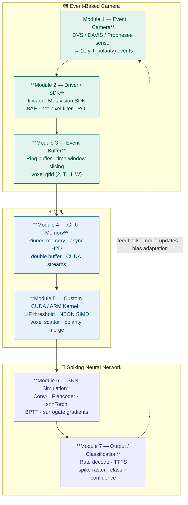
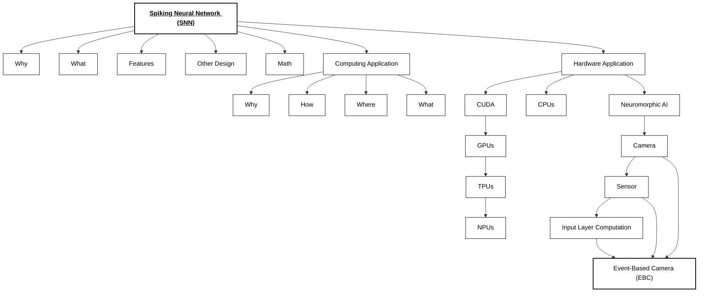

# SNN-GPU-Event-Based Camera Diagram

---
style M6 fill:#EEEDFE,stroke:#534AB7,color:#3C3489
    style M7 fill:#EEEDFE,stroke:#534AB7,color:#3C3489
## Installation

Follow these steps to install the necessary dependencies to run the application on your GPU related to this project.  

**[Installation.md](https://github.com/Zuzu3290/SNNs-auf-GPUs/blob/main/docs/installation.md)** 

# Project Mindmap

## To-Dos
This section contains all the tasks and research items planned for the project.  

See the **[To-Dos Markdown file](https://github.com/Zuzu3290/SNNs-auf-GPUs/blob/main/docs/To-Do.md)** 

