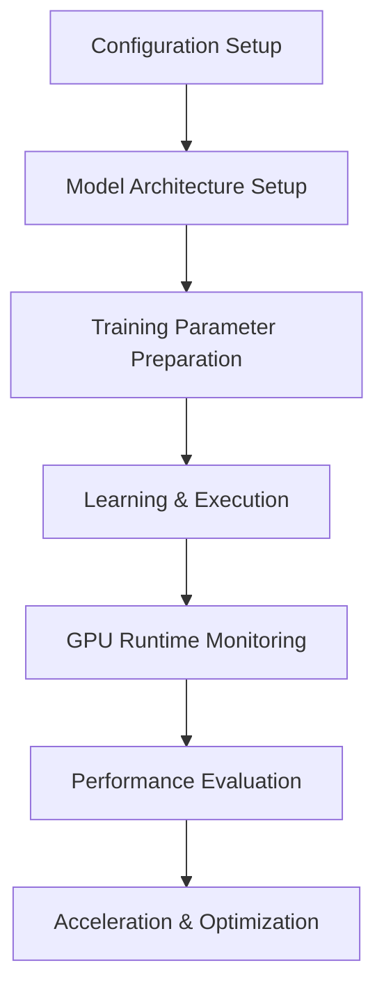

# Source

The `source/` folder contains the core implementation structure of the project. It is organized into five main modules, where each folder focuses on a specific part of the SNN development and optimization workflow.

Each module is designed to work independently, while also supporting the overall project pipeline for model configuration, learning, compilation, acceleration, runtime diagnostics, and future hardware-oriented integration.

---

## Folder Structure

| Folder | Purpose |
|---|---|
| [`learning/`](./learning/) | Handles model learning, training setup, dataset configuration, and training parameter flow. |
| [`CRC/`](./CRC/) | Supports computation-related logic, verification, and integration with optimized components. |
| [`compiler/`](./compiler/) | Provides compiler-related support for preparing, translating, or optimizing model execution. |
| [`acceleration/`](./acceleration/) | Focuses on GPU acceleration, custom kernel development, and performance optimization. |
| [`skeleton/`](./skeleton/) | Acts as the configuration and runtime diagnostics bridge between learning, GPU setup, and performance evaluation. |

---

## Purpose

The `source/` folder acts as the implementation backbone of the project.

It connects configuration files, model architecture, learning setup, GPU runtime behavior, logging, diagnostics, and acceleration components into one structured framework.

Its purpose is to support a modular SNN implementation pipeline that can be trained, evaluated, optimized, and extended over time.

---

## Core Workflow

```md


--- 

## Skeleton

The `skeleton/` folder is intended to provide the necessary configuration structure for both the learning module and GPU runtime setup.

It acts as a configuration bridge that helps pass required model settings, training parameters, and runtime configuration values into the learning workflow.

The `skeleton/` folder supports:

- Model configuration handling
- Training parameter setup
- Runtime configuration support
- GPU configuration setup
- Hardware-oriented computational integration
- Performance-related configuration control
- Runtime optimization support

It also provides a statistical bridge for evaluating GPU usage during runtime. This helps monitor how much the GPU is being utilized while the model is training or executing.

This makes it useful for:

- GPU utilization tracking
- Runtime performance evaluation
- Hardware performance diagnostics
- Understanding computational workload behavior
- Supporting future hardware integration

---

## Learning Interface

The `learning/` folder is responsible for handling the training-side workflow of the project.

It supports:

- Model configuration setup
- Training parameter definition
- Dataset configuration
- SNN architecture initialization
- Training execution flow
- GPU usage setup
- Internal logging during training and evaluation
- Report generation and model usage tracking

This module helps prepare the required training environment needed to build and evaluate the desired SNN model.

---

## GPU Diagnostics and Logging

The source framework includes support for GPU usage and runtime diagnostics.

This allows the project to monitor:

- GPU performance during training
- Computational workload behavior
- Training-time resource usage
- Model execution statistics
- Internal logs for debugging and evaluation

The logging system is intended to support training analysis, model evaluation, and reporting.

---

## Launch File

The launch file is currently under development.

It is intended to provide a simple application-level entry point for running the broader system workflow. This will help connect different parts of the project into a more accessible execution process.

---

## Acceleration

The `acceleration/` folder is designed for GPU-focused optimization.

It includes custom kernel development intended to interface with the `CRC/` layer. The purpose of this module is to improve computational performance, reduce execution time, and support more efficient GPU usage.

The acceleration layer supports the broader goal of making SNN implementations more practical for GPU-based deployment.

It focuses on:

- Custom kernel implementation
- GPU performance optimization
- Efficient computation
- Reduced training and execution time
- Better deployment applicability
- Energy-aware GPU usage
- Support for biologically inspired neuron computation

---

## Overall Goal

The overall purpose of the source structure is to support an efficient and modular SNN implementation pipeline.

Each folder contributes to a different part of the system, but together they help improve:

- Model configuration
- Training workflow
- GPU runtime setup
- Computational efficiency
- Logging and reporting
- Acceleration support
- Deployment readiness
- Future hardware integration

This structure provides the foundation for building, testing, optimizing, and extending SNN-based applications.